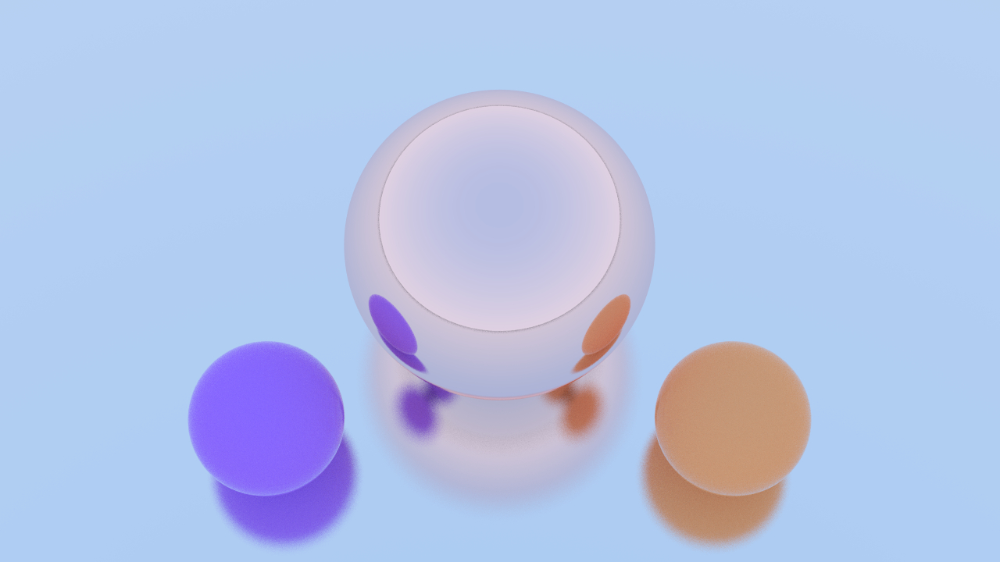
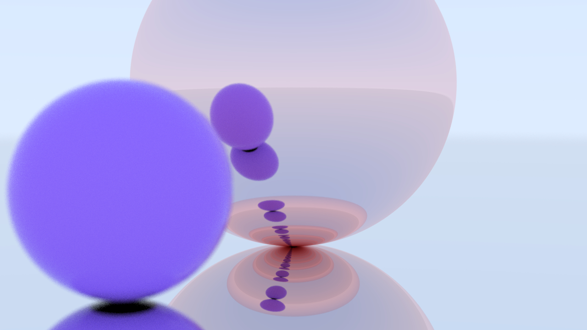
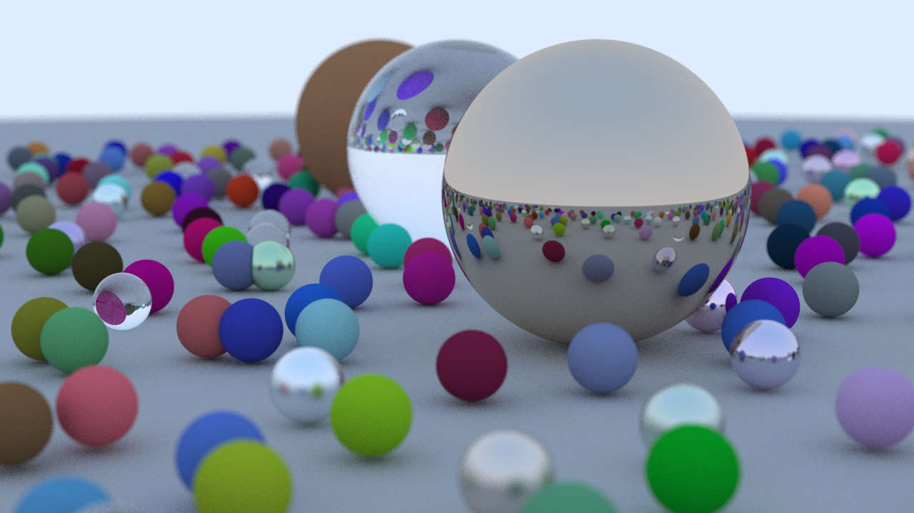

# Raytracer

This project is based on Peter Shirley's [Ray Tracing in One Weekend](https://raytracing.github.io/) Book Series.

In this project, I try to follow the book's instructions and also add my own touch to this Raytracer implementation.

I don't have any precise goal besides just having fun and enjoying graphics development :)

Current list of features
- Materials
    - Dielectric (transparent)
    - Metal
    - Lambertian (matte)
- Shapes
    - Spheres
- Camera effects
    - Depth of field
    - Rotation and transformation
- Others
    - Basic multithreading implementation

Here are a few images from the gallery:

